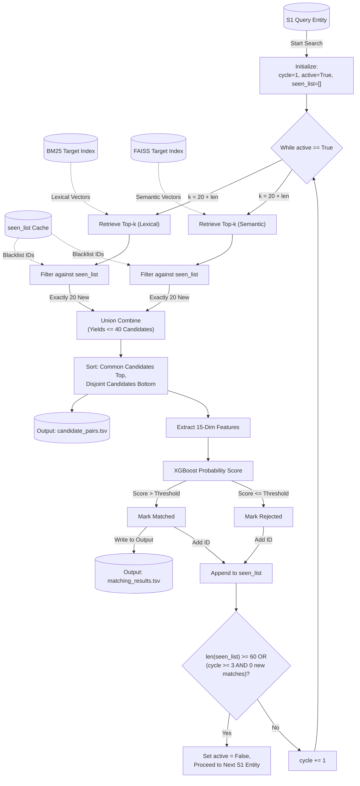

# Blocking 1.0: Progressive Cyclic DAG Pipeline

This document defines the final, robust architecture for Candidate Generation and Evaluation. It perfectly aligns with the Amazon ML Challenge constraints (multilingual, dynamic country scaling) and introduces a state-of-the-art **Progressive Cyclic DAG (Directed Acyclic Graph)**. 

Instead of overwhelming the ML model with 100 candidates per entity upfront, this pipeline intelligently retrieves candidates in cycles, evaluates them, memorizes rejections, and stops automatically when an entity is exhausted.

---

## 0. Preprocessing: Country-Wise Target Aggregation (The Foundation)
*Goal: Organize the datasets to optimize the search direction and handle unseen countries (like `France`) seamlessly.*

We must build our search index using the target records (Source 2 and Source 3) and use Source 1 as the query, ensuring every S1 entity gets a dedicated candidate list.

1.  **Target Combination:** Vertically concatenate all records from Source 2 and Source 3 into a single, unified "Target Dataset".
2.  **Runtime Country Discovery:** Scan the datasets and extract a list of all unique countries.
3.  **Physical Partitioning:** Split both the Query Dataset (Source 1) and the unified Target Dataset (S2 + S3) into isolated, country-specific lists (e.g., `Target_US`, `Query_US`, `Target_France`).

---

## 1. Dual-Stream Feature Extraction
*Goal: Capture exact character matches and semantic synonyms across any language natively.*

1.  **The Lexical Stream (`business_address`):** Convert to **Character 3-Gram TF-IDF**. This is mathematically language-agnostic, catching typos and exact numeric combinations natively.
2.  **The Semantic Stream (`business_name`):** Convert to dense vectors using a pre-trained **Multilingual Bi-Encoder** (e.g., `paraphrase-multilingual-MiniLM-L12-v2`). This flawlessly handles French, English, and Indian semantics (e.g., `Société` vs `SA`).

---

## 2. Dynamic Indexing, Dual Retrieval & Union (The Base Engine)
*Goal: Execute the search efficiently and combine the strengths of both streams.*

For each dynamically discovered country `C`:
1.  **Index Building:** 
    *   Build a **BM25 Index** using the lexical features of `Target_C` (Source 2 + Source 3).
    *   Build a **FAISS Index** using the semantic embeddings of `Target_C` (Source 2 + Source 3).
2.  **Dual Retrieval Execution:** For every query record (Source 1):
    *   Query the BM25 Index to retrieve the Top-`k` lexical matches.
    *   Query the FAISS Index to retrieve the Top-`k` semantic matches.
3.  **Union:** Merge the retrieved candidates from both streams. This yields a maximum of `2 * k` unique candidates per Source 1 entity (often fewer due to overlap), guaranteeing that almost zero true matches are missed before evaluation.

---

## 3. The Cyclic DAG Retrieval & Evaluation Process
*Goal: Actively retrieve candidates in cycles, maintaining a rejection blacklist, to save compute and maximize precision.*

For each dynamically discovered country `C`, we build a **BM25 Index** (Lexical) and a **FAISS Index** (Semantic) on `Target_C`. 

For every record in `Query_C` (Source 1), we initialize:
*   `seen_list = []` (Tracks both approved matches and ML-rejected candidates)
*   `cycle_count = 1`
*   `active_search = True`

While `active_search == True`:

### Step A: Dynamic Top-K Retrieval
We ensure that the ML model always receives exactly 20 *new, unseen* candidates per stream.
1.  Set `k = 20 + len(seen_list)`.
2.  Query BM25 to retrieve the Top-`k` lexical candidates.
3.  Query FAISS to retrieve the Top-`k` semantic candidates.

### Step B: Post-Filtering & Ordering (The Blacklist)
1.  Filter out any candidate ID that currently exists in the `seen_list` from **both** the BM25 results and the FAISS results individually.
2.  This leaves exactly 20 new, unseen candidates from BM25 and exactly 20 new, unseen candidates from FAISS.
3.  Combine these two lists into a final union of **<= 40 candidates** (depending on overlap).
4.  **Ordering Strategy:** Sort this combined list by placing the candidates retrieved by **BOTH** streams at the very top, and the disjoint candidates below them.

### Step C: ML Evaluation & Candidate Saving
1.  **Candidate Generation Output:** Append these <= 40 sorted candidates to `candidate_pairs.tsv`.
2.  Pass all <= 40 unseen candidates through the **Feature Engineering** phase to extract pairwise scores (Jaro-Winkler, Jaccard, Numeric Overlap).
3.  Pass the features into the **XGBoost ML Classifier**.
4.  **Routing:** 
    *   If `XGBoost Confidence > Threshold`: Mark as **Matched**. Append to final `matching_results.tsv`. Add ID to `seen_list`.
    *   If `XGBoost Confidence <= Threshold`: Mark as **Rejected**. Add ID to `seen_list`.

---

## 4. The Local Stopping Metric
*Goal: Prevent infinite loops and save compute by halting searches for entities that have exhausted their true matches.*

After Step C completes, we evaluate the stopping condition for this specific S1 entity:

1.  **Index Exhaustion Override:** If Step B yielded 0 new unseen candidates (e.g., a tiny country dataset is fully exhausted), instantly set `active_search = False` and skip to the next S1 entity.
2.  **Minimum Threshold:** Has the entity completed at least 3 cycles? (i.e., `cycle_count >= 3`).
3.  **The Metric:** Did Step C yield exactly **0 new matches** during the current cycle?
4.  **Action:** 
    *   If `len(seen_list) >= 60` OR `(cycle_count >= 3 AND new_matches == 0)`: Set `active_search = False`. We are done with this S1 entity. Move to the next S1 entity.
    *   Else: Increment `cycle_count += 1` and loop back to Step A.

---

## 5. Why This Architecture is "Bulletproof"
1.  **Guarantees Output Compliance:** By indexing S2+S3 and querying with S1, we strictly conform to the required output format.
2.  **No Wasted Compute:** The local stopping metric ensures we don't query FAISS for Cycle 4 if an S1 entity has already found all its matches. 
3.  **Memory Safe (Active Rejection):** By setting `k = 20 + len(seen_list)`, we bypass the limitations of FAISS/BM25 not having dynamic blacklisting, perfectly guaranteeing we always feed 20 *new* candidates to the heavy ML model.
4.  **Language Agnostic:** The Step 0 Preprocessing dynamically handles unseen test countries like France effortlessly.

---

## 6. Execution & Data Flowchart
This diagram explicitly maps the lifecycle of a single S1 Entity as it passes through the Candidate Generation phase. It visualizes exactly what is generated, where it is cached, and the exact stepwise mechanics of the dual-stream `<= 40` candidate union.

