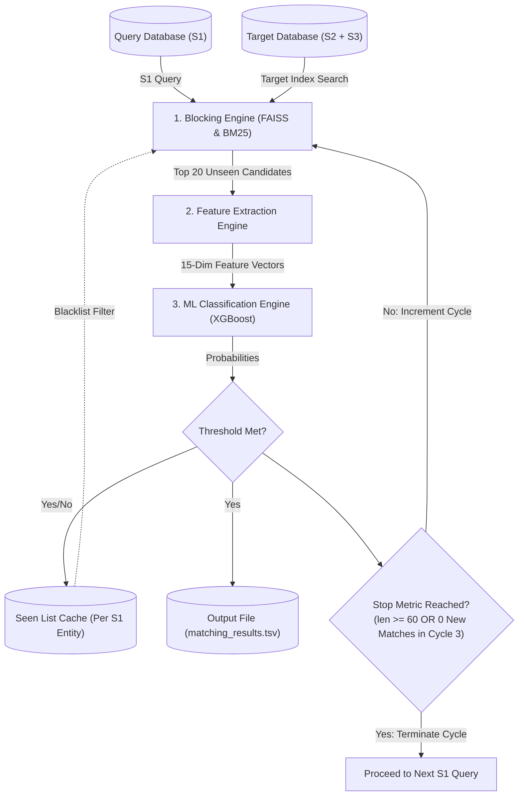
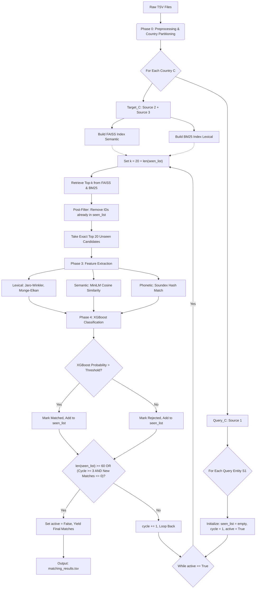

# Implementation Plan: Amazon ML Challenge ER Pipeline

This document outlines the technical execution plan for building the Progressive Cyclic DAG Entity Resolution pipeline we designed. 

## 1. Goal Description
The objective is to implement a robust, scalable Python codebase that takes raw `train_source1.tsv`, `train_source2.tsv`, and `train_source3.tsv` files, executes dynamic country-wise blocking using FAISS/BM25, extracts advanced pairwise features (Jaro-Winkler, Phonetics, Sentence-Transformers), and uses an XGBoost classifier within a Cyclic DAG to output perfectly formatted matches.

> [!IMPORTANT]
> **User Review Required:** Please review the proposed directory structure and Python dependencies below. Once approved, I will begin writing the actual code.

## 2. Proposed Project Structure
I propose organizing the Python code into modular layers (following the strict `modules/<module_name>/` scoping rule). 

```text
Amazon ML Challange/
├── src/
│   ├── main.py                     # The orchestrator script
│   ├── config.py                   # Hyperparameters (Thresholds, Paths)
│   ├── data_layer/
│   │   ├── loader.py               # Preprocessing and Country Partitioning (Phase 0)
│   │   └── cleaner.py              # Basic text normalization
│   ├── blocking_layer/
│   │   ├── semantic_index.py       # FAISS + Sentence Transformers (Phase 1/2)
│   │   └── lexical_index.py        # BM25 + TF-IDF (Phase 1/2)
│   ├── feature_layer/
│   │   ├── feature_extractor.py    # Jaro, Monge-Elkan, Phonetics (Phase 3)
│   ├── ml_layer/
│   │   ├── classifier.py           # XGBoost training and inference (Phase 4)
│   └── pipeline/
│       └── cyclic_dag.py           # The loop logic (Retrieval -> Filter -> ML -> Stop)
├── notebooks/                      # For EDA and manual threshold F_0.5 testing
├── requirements.txt
└── run.sh
```

## 3. Python Dependencies
We will create a `requirements.txt` with the following highly optimized libraries:
*   `pandas`, `numpy`: Data manipulation
*   `scikit-learn`: TF-IDF, Cross-Validation (GroupKFold)
*   `faiss-cpu`: High-speed vector similarity search
*   `rank_bm25`: Fast lexical inverted indexing
*   `sentence-transformers`: For `paraphrase-multilingual-MiniLM-L12-v2`
*   `xgboost`: State-of-the-art tabular classification
*   `jellyfish`, `pyphonetics`, `textdistance`: Extremely fast string distance metrics (Jaro-Winkler, Soundex).

## 4. Architectural Decisions & Recommendations

**Decision 1: Data Processing Engine (Polars)**
There is no strict rule enforcing Pandas. Therefore, we will use **Polars**. Polars is written in Rust, natively multi-threaded, and handles large-scale string operations and dataset joins vastly faster than Pandas while using significantly less RAM. This will prevent out-of-memory crashes on the 2.2M+ row datasets.

**Decision 2: Execution Environment (Local Processing with CUDA)**
Your **NVIDIA RTX 3060 (6GB VRAM)** is actually perfect for this! 
*   The embedding model we chose (`paraphrase-multilingual-MiniLM-L12-v2`) is incredibly lightweight (only ~470MB in memory). 
*   It will easily fit into your 6GB VRAM, allowing us to run inference with a high batch size (e.g., 256 or 512). 
*   What would take days on a CPU will only take about 15–30 minutes locally on your RTX 3060. We will set up the pipeline to use `torch` with `cuda` device mapping so everything stays completely local!

## 5. Project DAG & Cycle Breakdown

### 5.1 High-Level Data Flow & Cycle Logic
This flowchart illustrates the overarching architecture, showing exactly what data is generated, where it is cached, and how the engines interact within the cycle.



### 5.2 Detailed Execution Architecture
This flowchart breaks down the internal mechanics of each engine and the exact stepwise logic of the DAG.



## 6. Development Steps
1.  Initialize the project directory and create `requirements.txt`.
2.  Write the `data_layer` (Partitioning by country).
3.  Write the `blocking_layer` (Building FAISS and BM25 indices).
4.  Write the `feature_layer` (The 15-dimensional vector extraction).
5.  Write the `ml_layer` (XGBoost logic and F_0.5 optimizer).
6.  Construct the `cyclic_dag.py` orchestrator to tie them all together.
